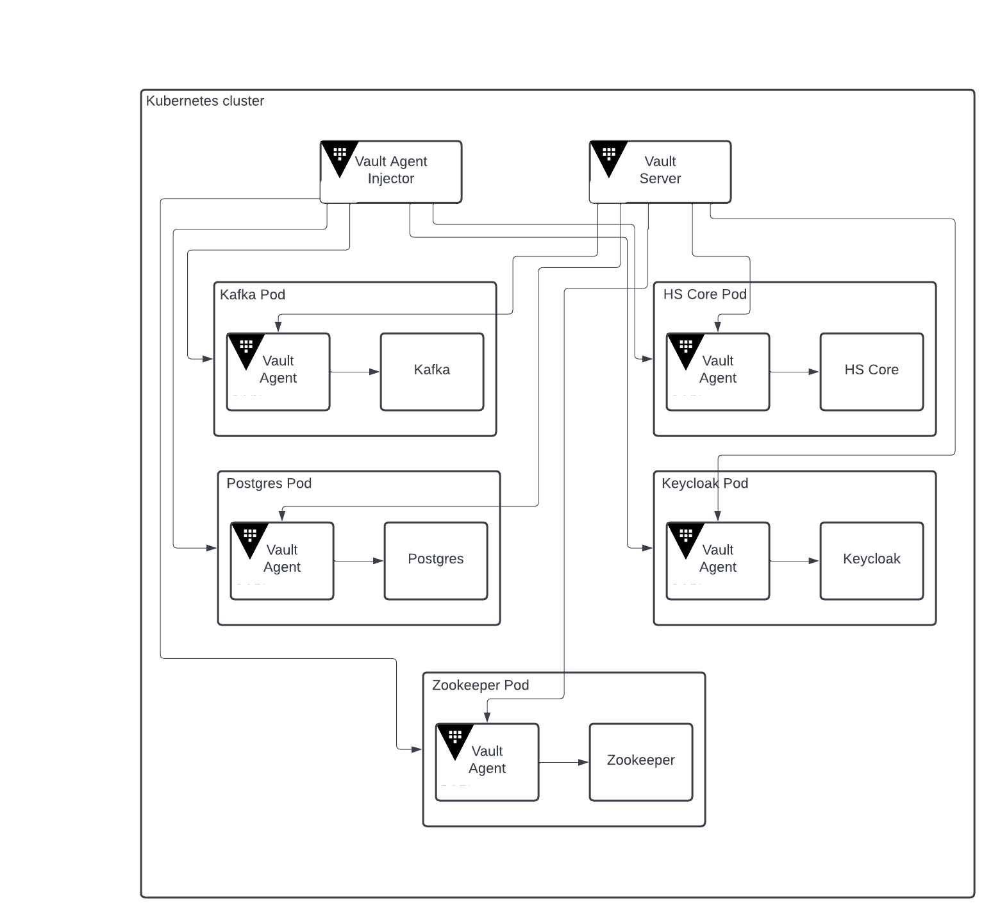

# Horizon Stream with Vault

This takes the existing Horizon Stream and uses Hashicorp Vault to store
secrets instead of using kubernetes secrets.

Vault connects into the existing pods through an agent, that is deployed by the
agent injector when specific annotations are found on the pod. The agent can be
used to inject secrets retrieved from the vault into containers through files and
environment variables. This provides a simple migration for containers already
written to work with kubernetes secrets.
\
Two deployment methods are available. The vault and all its components can
be deployed directly into the cluster along with horizon stream. This is the
default and is pictured above. Kubernetes authentication is used to authenticate
with the vault, allowing access based on namespace and service account used in the pod.
\
Alternatively, a separate script and options are available in the skaffold yaml
to deploy the vault outside of the cluster. This option deploys vault locally, but
could be used to connect multiple clusters to a single vault being run separately.
In this case, the agent injector and agent are still deployed in the cluster to
interface with the pods, but a separate external service and endpoint are defined
to connect out to the vault. The vault is configured to interface with kubernetes
and will still use the same kubernetes authentication.
